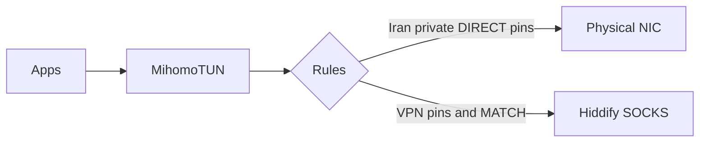
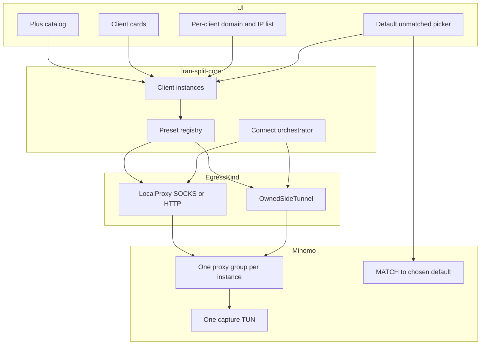

# Flexible VPN and proxy clients

## What exists today

BiFlow is a **two-layer** stack ([docs/considering/alternate-vpn-clients-as-mihomo-upstream.md](docs/considering/alternate-vpn-clients-as-mihomo-upstream.md)):

- **Mihomo** owns the only system TUN, DNS hijack, and Iran / private / pin rules.
- **Hiddify** is a single hardcoded SOCKS5 egress (`HiddifyConfig`, `BackendKind::ExternalHiddify`, `ensure_hiddify`, process bypass for `*Hiddify*` only).
- User pins are a **pair of lists**: `DirectRulesDocument.rules` (DIRECT) and `vpn_rules` (VPN). `Outbound` is `Direct | Vpn` in [crates/iran-split-rules/src/lib.rs](crates/iran-split-rules/src/lib.rs). Unmatched traffic is always `MATCH,VPN` → Hiddify.



Settings still has a **Hiddify** tab ([apps/desktop/src/components/Settings.tsx](apps/desktop/src/components/Settings.tsx)). Direct Rules toggles DIRECT ↔ VPN. Dashboard health is a fixed strip: helper / Hiddify / Mihomo / TUN / DNS.

## Review of [PR #5](https://github.com/devlifeX/BiFlow/pull/5) (`feat/openvpn-split-tunnel`)

+3528 / −232 across 55 files. Do **not merge as-is**. Keep the network design; throw away the third hardcoded route.

**Keep (this is the OwnedSideTunnel driver):**

- ADR 0067 invariants: `--route-noexec`, helper-installed scoped routes only, reject `0.0.0.0/0`, audit `.ovpn` for `up`/`down`/`plugin`/`script-security`, pin `--script-security 0` after `--config`.
- OpenVPN **fails alone** (`required` off): Connect continues with DIRECT + default proxy.
- Mihomo `direct` outbound bound to the helper-owned device (Linux fwmark + policy table; Windows `interface-name`).
- OpenVPN server `/32` emitted `DIRECT` above every other rule so the tunnel transport cannot recurse into `clash-iran`.
- Side-tunnel rule-sets **above** `private-networks` so RFC1918 behind the tunnel is reachable; loopback still wins.
- Windows spawn after `env_clear` restores `SYSTEMROOT` / `CREATE_NO_WINDOW` (same lesson as Mihomo).
- Frontend lesson already in their `AGENTS.md`: a third route breaks every two-way type (`"direct" | "vpn"`, toggle button, pin/drop-from-other-list). They wrote: prefer a list-driven form so the next route is not another variant.

**Reject as product architecture:**

- `Outbound::OpenVpn`, `openvpn_rules`, `AppConfig.openvpn`, `StackSnapshot.openvpn`, `starting_openvpn` as a fixed lifecycle stage.
- Settings **OpenVPN** tab next to Hiddify — the next client would be a fifth tab.
- `pinRoute(..., "direct" | "vpn" | "openvpn")` — the next client repeats this union everywhere (store, mock, Diagnostics `FlowResult`, live connections).

PR #5 is the right **OpenVPN driver**, the wrong **extension model**. The same PR already proved why: adding one client touched config, rules, core, helper, IPC, both platform crates, Mihomo YAML, mock, models, Dashboard, Direct Rules, Settings, i18n, e2e, and screenshots.

## Target architecture

The architecture has **two stable egress kinds**. New products are catalog presets (and sometimes a new driver). They are never new `Outbound` variants.



### 1. Egress kinds (the only code fork)

New crate or module, e.g. `crates/iran-split-clients/`, with a trait the engine and helper call:

```rust
enum EgressKind { LocalProxy, OwnedSideTunnel }

trait ClientDriver {
    fn preset_id(&self) -> PresetId;
    fn kind(&self) -> EgressKind;
    fn process_bypass(&self, platform: Platform) -> Vec<ProcessBypass>;
    fn transport_excludes(&self) -> Vec<IpNet>; // e.g. OpenVPN server /32
    async fn ensure(&self, instance: &ClientInstance, cancel: CancellationToken) -> Result<EgressHandle>;
    async fn stop(&self, handle: &EgressHandle) -> Result<()>;
    fn mihomo_outbound(&self, instance: &ClientInstance, handle: &EgressHandle) -> MihomoOutbound;
}
```

- **LocalProxy** — loopback SOCKS5 or HTTP, egress probe **before** TUN ([ADR 0018](docs/adr/0018-hiddify-egress-before-tun.md)), process-name DIRECT so TUN cannot recurse, optional auto-launch. Hiddify, Happ, v2rayN, Nekoray, Shadowsocks all share this driver. A new proxy client is a **preset row** (ports, process names, install hint), not a new engine path.
- **OwnedSideTunnel** — helper starts a binary that **must not** take the default route. Mihomo sends selected traffic via `interface-name` / fwmark. OpenVPN (PR #5) is the first driver. WireGuard later implements the same trait (`wg-quick` / `wireguard-go` with `Table = off`).

Windscribe (and any GUI that installs a default route + kill switch) is **not** a third kind in v1. It can appear in the catalog as `unsupported` until it exposes a local proxy or we own a cooperative tunnel. Document that in the ADR; do not pretend a settings toggle makes it safe.

### 2. Preset catalog (data)

Predefined, shipped in-repo (Rust `once_cell` / const table + mirrored TS):

| Preset | Kind | First-ship status |
| --- | --- | --- |
| Hiddify | LocalProxy | Working (migration of today’s config) |
| OpenVPN | OwnedSideTunnel | Working (PR #5 driver, not hardcoded route) |
| Happ | LocalProxy | Preset: ports + `Happ*` / `sing-box` bypass |
| v2rayN | LocalProxy | Preset: `10808` + `v2rayN` / `xray` / `v2ray` |
| Nekoray | LocalProxy | Preset: typical mixed port + process list |
| Shadowsocks | LocalProxy | Preset: local SOCKS port + process list |
| WireGuard | OwnedSideTunnel | Catalog visible; driver later |
| Windscribe | unsupported | Catalog visible; explain why |

Adding a catalog name must not touch `Outbound`, Settings tabs, or `StackSnapshot` field names.

### 3. Instances and pins (user data)

Replace `hiddify` / `openvpn` config blobs and parallel rule lists.

```rust
struct ClientInstance {
    id: ClientId,          // uuid
    preset: PresetId,
    enabled: bool,
    config: ClientConfig,  // tagged by EgressKind, not by preset
}

enum Outbound {
    Direct,
    Client(ClientId),
}

struct RoutePinsDocument {
    revision: u64,
    pins: Vec<PinnedRoute>, // target + outbound; one host, one outbound
}

struct AppConfig {
    // … mihomo, rules, behavior
    clients: Vec<ClientInstance>,
    default_route: DefaultRoute, // MATCH destination; user-chosen
}

enum DefaultRoute {
    Direct,            // unmatched leaves via physical NIC
    Client(ClientId),  // unmatched goes to this client's group
}
```

`Direct` must be a valid unmatched choice (zero clients added, or user wants "only pinned hosts tunnel"). There is no `None` state: migration always yields a concrete value, and deleting the referenced client falls back to `Direct` with a UI notice.

**Instance removal / disable semantics** (must be explicit, or pins dangle):

- Deleting an instance deletes its pins after a confirm dialog that shows the pin count (offer "move pins to <other client>" when at least one other enabled client exists).
- Disabling an instance keeps its pins in the document but they are **not emitted** into Mihomo YAML; Direct Rules shows them greyed with the client name.
- If the deleted/disabled instance is the MATCH default, `default_route` falls back to `Direct` and the Dashboard badge moves accordingly.

`RuleManager::pin(input, outbound, revision)` already moves a host between lists. Change it to **one list** + `Outbound::ALL` as the set `{ Direct } ∪ enabled client ids` (exactly the lesson in PR #5). Private / loopback / CGNAT still cannot go to a LocalProxy; loopback still cannot go to a side tunnel; RFC1918 **may** go to an OwnedSideTunnel (PR #5 rule).

Schema bump (`CURRENT_SCHEMA_VERSION` 2 → 3 in [crates/iran-split-config/src/lib.rs](crates/iran-split-config/src/lib.rs)):

- Old `hiddify` → one enabled Hiddify instance; `default_route` = `Client(that id)`.
- Old `vpn_rules` → pins to that Hiddify id.
- Old `rules` → `Outbound::Direct`.
- If a later import sees PR #5 `openvpn` / `openvpn_rules`, map them to an OpenVPN instance and its pins.

### 4. Connect and Mihomo generation

[crates/iran-split-core/src/lib.rs](crates/iran-split-core/src/lib.rs) `start_steps` today: helper → `ensure_hiddify` → generate → start Mihomo → readiness.

Replace with:

1. Helper available.
2. For each **enabled** instance, `driver.ensure` in a generic `starting_client` stage (payload: `preset` + `client_id`, never `starting_hiddify` / `starting_openvpn` as enum variants). LocalProxy still probed before TUN.
3. Generate YAML from **all** ready handles:
   - one `proxies[]` / `proxy-groups[]` per instance (`name` = stable group id);
   - one domain + IP rule-provider pair per instance (`custom-<id>-domains.txt` / `…-ips.txt`);
   - process-bypass union of every LocalProxy;
   - transport excludes from every OwnedSideTunnel, `DIRECT`, first;
   - side-tunnel rule-sets above `private-networks`;
   - `MATCH,<default>` — the chosen client's group, or `DIRECT` when `default_route = Direct`.
4. Helper starts Mihomo TUN as today.
5. Optional side tunnel that fails: mark that instance degraded; if it is the MATCH default, fail Connect (or require the user to pick another default). Non-default tunnels keep PR #5’s fail-alone behavior.

[crates/iran-split-mihomo/src/lib.rs](crates/iran-split-mihomo/src/lib.rs) must stop emitting a single `ProxyConfig { name: "Hiddify" }`. `providers()` / helper `GENERATION_FILES` (today a fixed `[&str; 9]` in [crates/iran-split-helper/src/lib.rs:24](crates/iran-split-helper/src/lib.rs:24)) become **dynamic** so a new client does not require a helper rebuild. Because the helper is privileged, the dynamic allowlist must stay strict: accept exactly `custom-<id>-domains.txt` / `custom-<id>-ips.txt` where `<id>` matches `[0-9a-f-]{36}` (the ClientId uuid), plus the existing fixed names — never a caller-supplied path, no separators, no `..`. Group names in YAML derive from the same sanitized id, not from the user-visible label (labels go only in UI).

Snapshot: `clients: Vec<ClientComponentStatus>` plus existing helper / mihomo / tun / dns. Drop fixed `hiddify` (migrate UI). Dashboard cards are `clients.map(...)`.

Helper IPC: generic `start_side_tunnel` / `stop_side_tunnel` with `driver: "openvpn" | …`. Move [PR `openvpn.rs`](https://github.com/RezaMahdaviiDev/BiFlow/blob/feat/openvpn-split-tunnel/crates/iran-split-helper/src/openvpn.rs) behind that. LocalProxy launch stays in the unprivileged desktop/platform crate (today’s Hiddify path).

### 5. Frontend

Do **not** add an OpenVPN Settings tab. Client-specific fields live on the client card.

**Dashboard (Advanced)** — the “app opens, press +” surface the request describes:

- List of added instances (status light, preset name, “default for unmatched” badge).
- **+** opens a catalog picker (predefined list; already-added presets disabled or allow a second instance later — v1 = one instance per preset).
- Choosing a preset adds the instance and opens its setup (Hiddify: port / launch; OpenVPN: `.ovpn` + auth; LocalProxy siblings: port + optional exe).
- Unmatched traffic: radio / select **Default for everything else** bound to `default_route` — options are **Direct** plus every enabled client.
- Health strip is built from `snapshot.clients` (PR #5 already hid OpenVPN when disabled — keep that idea, make it generic).

**Per-client domain/IP list** on the same card (or a slide-over): add host, list pins for that `ClientId`, remove. This is the flow “Hiddify gets these domains, OpenVPN gets those.”

**Direct Rules** stays the **global** table: one outbound `<select>` whose options are `DIRECT` plus every enabled client (PR #5’s compact select, not a two-way toggle; no visible label — their 390px lesson). `pinRoute(input, outbound)` takes `direct` or a client id.

**Settings:** only Mihomo + Behavior. Hiddify tab fields move to the Hiddify card.

**Diagnostics / live connections / reachability:** `outbound` is `direct | { client_id, label }`. `FlowResult` “move to the other side” becomes a small outbound picker, not `direct | vpn`.

**Basic mode:** keep Connect / Pause. Auto-migrate still provides a Hiddify instance so first launch behaves as today. Bottom nav stays five items (no sixth “Clients” tab on 390px).

**Mock + e2e:** [apps/desktop/src/api/mock.ts](apps/desktop/src/api/mock.ts) implements the same pin/MATCH rules. New e2e: add OpenVPN (or a mock LocalProxy), pin a host, set default MATCH, Connect stages include generic `starting_client`. Update [e2e/readme-screenshots.spec.ts](e2e/readme-screenshots.spec.ts) and `docs/screenshots/`.

### 6. Docs, version, tests

- New ADR: **client registry and egress kinds** (supersedes the “Hiddify is the only upstream” assumption in ADR 0018/0025 wording; those ADRs stay for probe-before-TUN and Pause-leaves-upstream).
- Rewrite PR ADR 0067 as **OwnedSideTunnel invariants** (protocol-agnostic), with OpenVPN as the first driver.
- Update [docs/considering/alternate-vpn-clients-as-mihomo-upstream.md](docs/considering/alternate-vpn-clients-as-mihomo-upstream.md) status to implemented-in-part.
- Bump root `version`, `pnpm version:sync`.
- Unit: pin move across N clients; MATCH follows `default_route` (client and Direct); generation emits N groups; helper rejects a non-uuid generation filename; delete-client drops its pins and falls back to Direct; OpenVPN profile audit still refuses scripts; schema 2 → 3 migration.
- Clippy per touched crate; `cargo fmt --all --check`; `pnpm check` + `pnpm build`; Playwright for the + catalog and pin-to-client flow.

## Delivery order (one architecture, staged adapters)

1. **Foundation** — `Outbound::Client(id)`, pin document, config schema 3, generic snapshot/stages, Clients UI + catalog + MATCH picker, Hiddify migrated as the first LocalProxy. Product still works exactly as today.
2. **OpenVPN driver** — port PR #5 helper/platform/Mihomo bind into `OwnedSideTunnel`; expose OpenVPN in the catalog. Do not land their `openvpn_rules` types.
3. **SOCKS presets** — Happ, v2rayN, Nekoray, Shadowsocks as LocalProxy rows (same driver as Hiddify).
4. **Later** — WireGuard driver; Windscribe only if proxy mode exists.

Steps 3–4 do not change engine, helper IPC shape, pin format, or Dashboard card mapping.

## Phase 2 — Named lists, installers, Windscribe

### Named rule lists (replaces flat pins as the user-facing model)

Flat `pins: Vec<PinnedRoute>` stays the engine contract; **lists become the
user model on top of it**. A list is a named bundle of domains *and* IPs with
exactly one outbound (same one-host-one-outbound invariant, now at list level):

```rust
struct RuleList {
    id: ListId,            // uuid
    name: String,          // user label; never used in YAML or file names
    outbound: Outbound,    // Direct | Client(id)
    domains: Vec<String>,
    ips: Vec<IpNet>,
}

struct RouteListsDocument { revision: u64, lists: Vec<RuleList> }
```

Rules:

- **Generation merges, engine unchanged.** At generate time all lists with the
  same outbound are unioned into the *existing* provider files
  (`custom-direct-*.txt`, `custom-<client-id>-*.txt`). Mihomo YAML, the helper
  allowlist, and the drivers do not change at all — lists are a data-layer
  refactor only.
- **Defaults.** Migration converts today's pins into a "Direct" list plus one
  list per client that has pins. Adding a client from the catalog auto-creates
  an empty list named after the preset, assigned to it.
- **Minimum one entry.** An empty list is skipped at generation and shown as
  "not in use" in the UI (nudge, not a Connect blocker — the MATCH default
  client legitimately needs no pins).
- A host may appear in only one list (moving it between lists = the old
  pin-move). Deleting a list = confirm dialog with entry count; deleting a
  client offers move-lists-to (same UX as pin move today).
- `pinRoute(host, outbound)` keeps working: it writes into the target
  outbound's first (or auto-created) list, so Diagnostics "pin this host"
  flows stay one-tap.

### List Management UI (replaces the Direct Rules page)

- Bottom-nav label: **List Management** (fa: «مدیریت لیست‌ها»). Same slot, no
  sixth tab.
- Page = list cards: name, entry count, outbound `<select>` (DIRECT + enabled
  clients — the compact select from Phase 1), expand → entry editor (one input
  that accepts a domain or IP, auto-detected exactly like today's pin input),
  per-entry remove, delete list.
- "New list" button; client cards on the Dashboard show their assigned lists
  as chips linking here.
- Keep it flat and boring: no folders, no nesting, no per-entry outbound.

### List diagnostics

"Check list" button per list: probe the **first 3 domain entries** through the
list's assigned outbound and show ok / slow / fail per entry (reuse the
Reachability result UI):

- Stack **running**: fetch through Mihomo's `mixed_port` — rules apply, so the
  probe exercises the real end-to-end path for that outbound.
- Stack **stopped** and outbound is a LocalProxy client: probe through the
  client's SOCKS directly (same code as the pre-TUN egress probe).
- Stack stopped and outbound is Direct or a side tunnel: button disabled with
  a "connect first" hint.

### Per-preset Download & Install

`PresetSpec` gains official download links:

```rust
downloads: PresetDownloads { linux: &'static str, windows: &'static str }
```

Client card and catalog rows show **Download & Install** for the current
platform. v1 behavior: open the official vendor page/release URL in the
browser (`shell::open`) plus the existing install hint. The app must **not**
silently download and execute binaries; a later iteration may do managed
downloads with pinned SHA-256 verification, behind an explicit user action.
Helper stays out of installation entirely.

### Windscribe: yes, via OpenVPN

Three candidate paths, one is sound:

1. **Generated OpenVPN profile (supported).** Windscribe's config generator
   (build.windscribe.com, paid accounts) emits a standard `.ovpn` + service
   credentials. That is exactly the existing `OwnedSideTunnel` OpenVPN driver
   — no new code beyond flipping the catalog row: Windscribe becomes
   `kind: OwnedSideTunnel`, `status: Working`, install hint explains
   generating the profile and pasting service credentials (auth-user-pass is
   already wired end to end).
2. **Proxy Gateway (rejected).** The desktop app can expose a local
   SOCKS/HTTP gateway, but it only works while the Windscribe GUI is
   connected — and a connected GUI owns the system default route + firewall,
   which fights our TUN for every packet. Document as unsafe; do not ship.
3. **Third-party standalone proxies (rejected).** Unofficial tools that speak
   Windscribe's API are unvetted binaries handling credentials; out of scope.

ADR update: Windscribe moves from "unsupported" to "supported via OpenVPN
profile"; the GUI-client caveat stays documented.

## What this deliberately does not do

- Two system default routes, or adopting Windscribe/WireGuard GUI TUN as-is.
- Per-client Iran lists (bundled Iran + business catalog stay DIRECT, ahead of MATCH).
- Asking the other client to do split routing. Mihomo remains the only rule engine.
