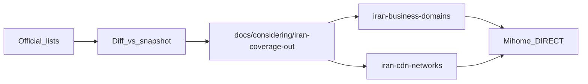

# Expand Iranian DIRECT domains and IP ranges

The 62,828-entry [`resources/rules/iran-domains.txt`](resources/rules/iran-domains.txt) already includes `+.ir`, so every `.ir` name is covered. The 2,888 CIDRs in [`resources/rules/iran-networks.txt`](resources/rules/iran-networks.txt) come from Chocolate4U `ircidr.txt`. Hand-editing those two files would be wiped by `pnpm rules:update` and would break SHA-256 provenance (ADR 0022 / 0054).

Ship extras the same way as the 14-entry business catalog: **curated files with sources metadata**, plus a review dump so nothing is invented.

## 1. Research dump (do not invent)

Add [`scripts/research-iran-coverage.mjs`](scripts/research-iran-coverage.mjs) that loads the current snapshot, fetches only documented sources, and writes:

- [`docs/considering/iran-coverage-out/domains-missing.txt`](docs/considering/iran-coverage-out/domains-missing.txt)
- [`docs/considering/iran-coverage-out/cidrs-missing.txt`](docs/considering/iran-coverage-out/cidrs-missing.txt)
- [`docs/considering/iran-coverage-out/REPORT.md`](docs/considering/iran-coverage-out/REPORT.md) (counts, source URLs, already-covered vs new)

**Domain sources:** bootmortis/iran-hosted-domains (MIT, **direct** category only — never ads/proxy), Tehran Index sector pages, and first-party official sites. Drop anything already matched by `iran-domains` suffix rules (`+.ir`, `+.arvancloud.com`, …) or the existing curated catalog.

**IP sources (official only):**

- Arvancloud published IP list (verify the live URL at fetch time; historically `https://www.arvancloud.ir/en/ips.txt`)
- Other Iranian cloud/CDN pages with an official prefix list (ParsPack / Liara / similar **only if** the page is first-party)
- RIPEstat [country-resource-list](https://stat.ripe.net/docs/data-api/api-endpoints/country-resource-list) `resource=IR&v4_format=prefix` as a **gap report** against `iran-networks.txt`

CIDR diff must use **containment**, not only exact-string match: skip `a.b.c.0/24` if `iran-networks` already has a covering supernet.

Keep the dump under `docs/considering/` so it is reviewable. Do not commit raw third-party dumps that we did not filter.

## 2. Ship a verified subset (live DIRECT)

**Domains** — append first-party, non-`.ir`, non-CDN roots to:

- [`resources/rules/iran-business-domains.txt`](resources/rules/iran-business-domains.txt) (`+.example.com`)
- [`resources/rules/iran-business-domains.sources.json`](resources/rules/iran-business-domains.sources.json) (`domain`, `category`, `official_url`, `discovered_from`, `verified_at`, `status`)

Same ADR 0054 gate as today: no `.ir`, no Cloudflare/Google/shared analytics, ownership must be clear.

**IPs** — new curated provider (mirrors business domains so `pnpm rules:update` cannot wipe it):

- `resources/rules/iran-cdn-networks.txt` (plain CIDR lines)
- `resources/rules/iran-cdn-networks.sources.json` (prefix, publisher, official_url, verified_at)
- New `curatedCatalog` row in [`scripts/sync-rules.mjs`](scripts/sync-rules.mjs) (`kind: ip_cidr`, `source: "curated"`)
- [`resources/rules/manifest.json`](resources/rules/manifest.json) + [`SNAPSHOT.md`](resources/rules/SNAPSHOT.md) hashes/counts

Ship **Arvancloud (and other official CDN/cloud) prefixes that are not already covered**. RIPEstat country gaps go into the out-file; only add them to the curated IP file when they are missing **and** not already contained in `iran-networks`. Do not union the entire IR RIR table blindly (false-DIRECT risk).

## 3. Wire the new IP file through generation

Same checklist as `iran-business-domains.txt`:

- Mihomo: `RULE-SET,iran-cdn-networks,DIRECT,no-resolve` next to `iran-networks` in [`crates/iran-split-mihomo/src/lib.rs`](crates/iran-split-mihomo/src/lib.rs); add the file provider; **do not** put CIDRs in `fake-ip-filter`
- Copy into the generation dir on **both** backends ([`iran-split-platform-linux`](crates/iran-split-platform-linux/src/lib.rs), [`iran-split-platform-win`](crates/iran-split-platform-win/src/lib.rs))
- Helper allowlist: grow `FIXED_GENERATION_FILES` in [`crates/iran-split-helper/src/lib.rs`](crates/iran-split-helper/src/lib.rs)
- Embed/copy as curated in [`crates/iran-split-rules/src/cloud.rs`](crates/iran-split-rules/src/cloud.rs) (`CURATED_FILES`); CloudRuleStore still fetches **only** the three Chocolate4U files
- `test_route`: fold extra CIDRs into `RuleSet` Iran CIDR matching (same `DecisionReason::IranCidr`) in [`crates/iran-split-rules/src/lib.rs`](crates/iran-split-rules/src/lib.rs) and [`crates/iran-split-cli/src/main.rs`](crates/iran-split-cli/src/main.rs)
- [`scripts/tauri-contract.test.mjs`](scripts/tauri-contract.test.mjs) provider name list
- [`scripts/update-rules.sh`](scripts/update-rules.sh) validation YAML if it lists rule-providers

`.gitattributes` already marks `resources/rules/* -text`.

## 4. Tests, ADR, version

- Unit: a sample Arvan (or other shipped) CIDR is DIRECT; a client IP pin still wins; `pnpm rules:check` hashes; cloud refresh does not overwrite the curated IP file
- Mock/`test_route`: one new business domain (if any) and one new CIDR
- ADR `0083` (curated Iranian CDN/ISP CIDRs) + update [`docs/adr/0054-curated-iranian-business-domains.md`](docs/adr/0054-curated-iranian-business-domains.md) / [`docs/adr/README.md`](docs/adr/README.md)
- Lesson in [`AGENTS.md`](AGENTS.md): never merge extras into Chocolate4U snapshots; extra CIDRs need containment-diff + official URLs
- Bump root [`version`](version) (currently 6.2.10) and `pnpm version:sync`

Done gate: `pnpm check` + `pnpm build`; `cargo test`/`clippy -D warnings` on each touched crate; `cargo fmt --all --check`; `pnpm rules:check`. No `cargo clean`. No README screenshots (routing data, not chrome).
