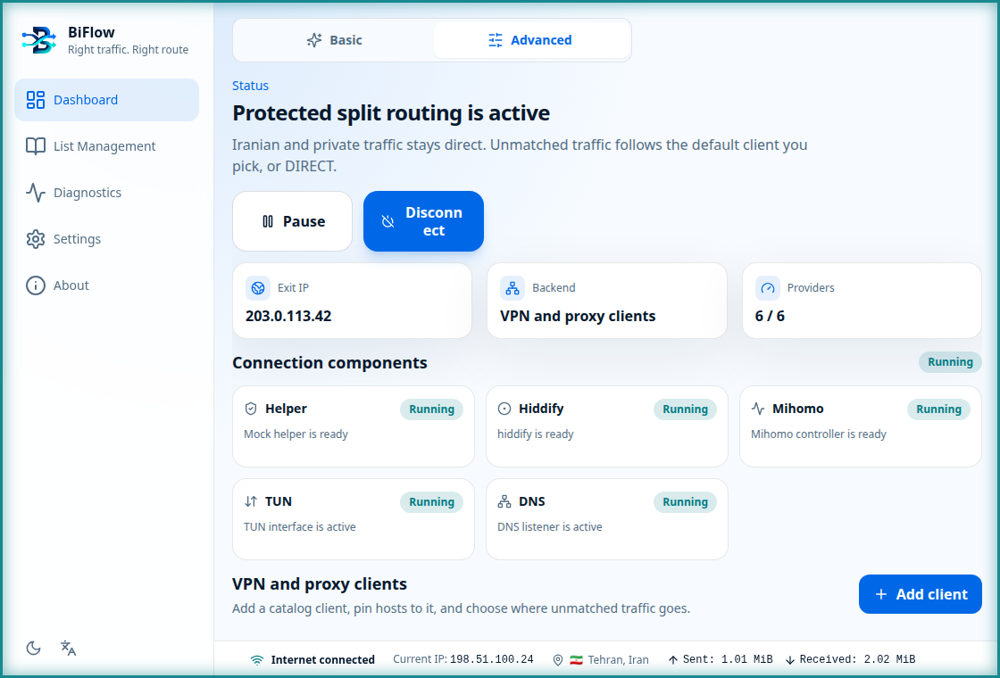
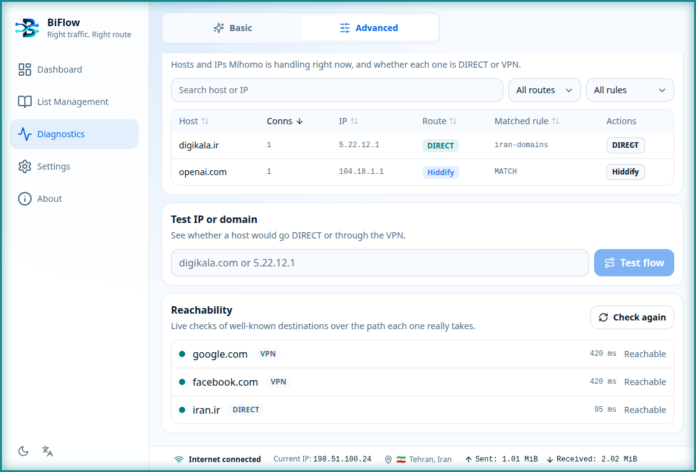
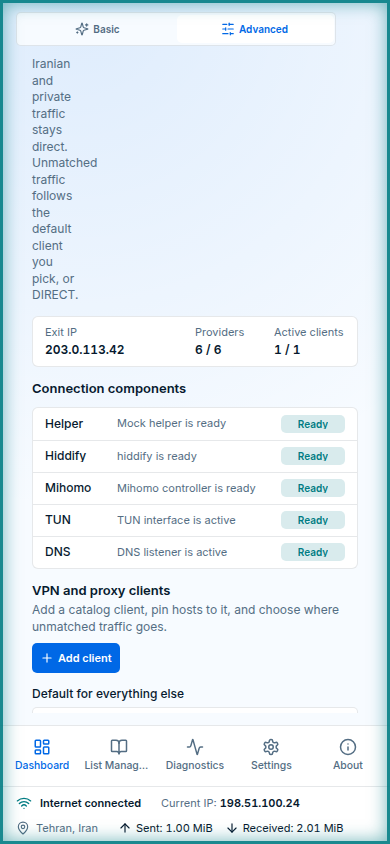
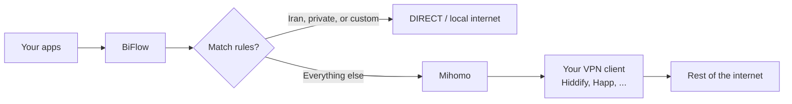
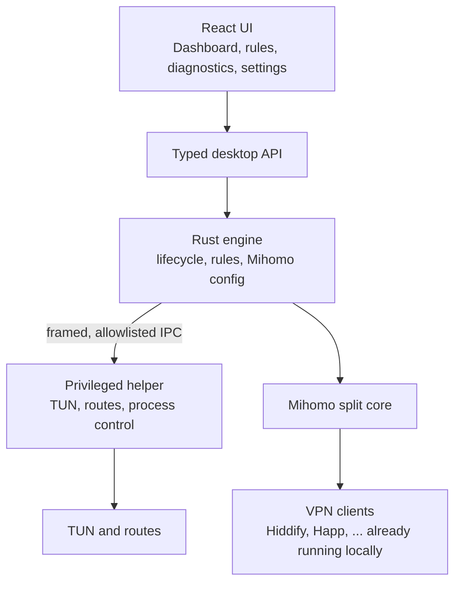

<p align="center">
  
</p>

<h1 align="center">BiFlow</h1>

<p align="center"><strong>Right traffic. Right route.</strong></p>

<p align="center">
  Iranian and private traffic stays on the local internet.<br />
  Everything else follows the VPN client you already use — Hiddify, Happ, and friends.
</p>

<p align="center">
  <a href="#features">Features</a>
  ·
  <a href="#how-it-works">How it works</a>
  ·
  <a href="#architecture">Architecture</a>
  ·
  <a href="#develop">Develop</a>
  ·
  <a href="#faq">FAQ</a>
</p>

<p align="center">
  
</p>

<p align="center">
  
</p>

<p align="center">
  
</p>

---

## Features

- **Split routing** — Iranian sites, Iranian IP ranges, and private/LAN traffic stay **DIRECT**. Everything else uses the VPN client you already have.
- **Multiple clients, your choice of primary** — Register Hiddify, Happ, v2rayN, Nekoray, or Shadowsocks side by side and promote any of them to the default route; Hiddify is not required when another client is primary. OpenVPN profiles (including Windscribe) run as an audited side tunnel. Pin single domains to a specific client — e.g. keep Google on Happ while everything else rides Hiddify — and a client that comes up minutes after Connect is attached to live routing automatically.
- **Connect, Pause, Resume, Disconnect** — One operation at a time. The active button shows the real stage (Start Hiddify, Start Mihomo, and so on) with an in-button progress fill.
- **Basic and Advanced** — First launch opens Basic. Advanced adds component health, live traffic routes, and extra tools.
- **Direct rules** — Pin hosts to DIRECT or VPN in a sortable table with one-click route switching. Refresh the bundled Iran domain and IP lists from the BiFlow cloud snapshot.
- **Live connections** — One row per domain with a connection count, resolved IPs, route, and matched rule. Sort any column and send a host to the opposite route without leaving the table.
- **Diagnostics** — Probe Google, Facebook, and iran.ir to see if the node or DIRECT path is reachable. Test a host, then move it. Export or clear the local `debug.log`. Fresh Hiddify start repairs a blank Hiddify window without touching subscriptions.
- **DIRECT DNS presets** — Fake-ip by default; Shecan, Electro, Radar, Mokhaberat, or custom resolvers are one Settings choice away for DIRECT domains. DIRECT domains always resolve to their real addresses.
- **Browser-friendly routing** — Clears a Hiddify-owned system proxy while connected so browsers actually use the split routing, and rejects VPN-bound QUIC so pages fall back to working TCP instead of hanging.
- **Status bar** — Internet reachability, public IP, approximate country, and lifetime sent/received totals.
- **In-app install** — Connect can install the privileged helper, the bundled Mihomo build, and Hiddify when they are missing. Hiddify is only fetched while an enabled Hiddify client exists.
- **English and Persian** — Built-in UI languages, with a tray menu for Connect/Disconnect, Pause/Resume, and Quit.
- **Linux and Windows** — Debian package, AppImage, portable `.exe`, and NSIS setup. Signed AppImage and NSIS builds can update in-app.
- **Fits the window** — Desktop sidebar, phone-sized bottom navigation, and a resizable window down to 390×640.

## Description

BiFlow is a desktop app for split routing. It keeps Iranian websites, Iranian IP
ranges, and private/local networks **DIRECT**. Other destinations go through
your existing local VPN client — **Hiddify** by default, with **Happ**, v2rayN,
Nekoray, and Shadowsocks as first-class alternatives — using **Mihomo** as the
split engine. Any registered client can be the default route, and individual
domains can be pinned to a specific client.

The window always runs as your normal user. Privileged work (TUN device, routes)
stays in a small helper process with a strict command list. BiFlow does not
replace your VPN client. It sits beside it and chooses the path for each
destination.

English and Persian are built in. The dashboard reports exact helper, Hiddify,
Mihomo, TUN, and DNS state; its status bar shows internet reachability, public
IP, and approximate country. Mihomo and the full Iran rule snapshot ship inside
the OS package, so their first use does not need a download. Hiddify remains an
allowlisted official download when it is missing.

## How it works

1. Install BiFlow (Linux `.deb`, or Windows app / NSIS setup).
2. Keep your VPN client installed and able to listen locally — Hiddify by
   default, or any other client you promoted to the default route. BiFlow
   installs its bundled Mihomo build when needed.
3. Open **Direct rules** if you want extra sites or IPs to stay DIRECT, or to
   refresh Iran domain and IP lists from the cloud.
4. Press **Connect**. BiFlow prepares a routing generation, starts Mihomo, and
   asks the helper to attach the TUN and routes. **Pause** stops owned routing
   and Mihomo while leaving Hiddify running; **Resume** rebuilds the split
   stack. **Disconnect** tears owned state down and may also stop Hiddify when
   that setting is on.
5. Iranian, private, and your custom rules stay DIRECT. Other traffic uses
   your VPN client. The dashboard animates both routes while connected, and
   **Diagnostics** can test a host and show DIRECT vs VPN before you rely on it.
   Its support export includes the permanent, locally redacted `debug.log`,
   which records Rust actions, warnings, errors, causes, initiators, and trace
   IDs for troubleshooting. Diagnostics shows its size and lets you reveal or
   delete it when you choose.
6. **Disconnect** tears the owned TUN and routes down. A failed start rolls back
   instead of leaving a half-applied network.

Cloud rule updates fetch the BiFlow-owned manifest, then the files from that
same snapshot. A failed refresh keeps the last good cache, or the snapshot
bundled with the app. Maintainers refresh the bundled snapshot with
`./scripts/update-rules.sh` (also `pnpm rules:update`); that command does not
commit or push.



## Architecture

BiFlow is a Tauri 2 desktop app: a React UI in a webview, a Rust engine in the
same process, and a privileged helper in a separate process.



| Piece       | Role                                                                                                                                                                                 |
| ----------- | ------------------------------------------------------------------------------------------------------------------------------------------------------------------------------------ |
| **UI**      | Basic or Advanced shell, Connect/Pause/Resume/Disconnect, install missing apps, cloud and custom DIRECT rules, flow tests, About/updates. No shell and no general filesystem access. |
| **Engine**  | Owns configuration, rule decisions, Mihomo YAML, and rollback. Talks to the UI only through the typed API.                                                                           |
| **Helper**  | Applies TUN and routes. The split stack accepts generation IDs and hashes only; OpenVPN side-tunnel profiles are audited and executables must be regular, non-symlink files — never shell strings or arbitrary URLs. |
| **Mihomo**  | Enforces split routing. Controller binds to loopback with a generated secret.                                                                                                        |
| **Clients** | Upstream proxies you already use — Hiddify, Happ, v2rayN, Nekoray, Shadowsocks, or an OpenVPN side tunnel. BiFlow does not log into them or replace them.                            |
| **Rules**   | Bundled Iran lists, optional refresh from `devlifeX/BiFlow`, plus your extra DIRECT domains and IPs.                                                                                 |

Internal Rust crates still use the `iran-split-*` names. The product name, window
title, and install identifiers are **BiFlow**.

## Develop

Prerequisites: Node.js 24+, pnpm 9.0.1, Rust 1.88. Linux desktop builds also
need WebKitGTK 4.1 and GTK 3 development packages.

Optional workflow lint (do not install `act` on this machine):

```bash
# actionlint v1.7.7
go install github.com/rhysd/actionlint/cmd/actionlint@v1.7.7
actionlint
```

```bash
./dev.sh          # native Tauri app (UI talks to Rust)
./dev.sh web      # browser UI with a safe mock backend
./dev.sh check    # format, lint, typecheck, tests
./dev.sh e2e      # Playwright primary flows against the mock UI
```

`./dev.sh` and `./dev.sh desktop` compile the real app and, on Linux, ask for
`sudo` to run a hardened transient helper for your developer UID. The helper
socket and runtime stay under `/run/biflow-dev-<uid>`; verified helper and
Mihomo binaries live under `/var/lib/biflow-dev-<uid>` because `/run` is
typically mounted `noexec`. Everything is stopped and removed when `dev.sh`
exits. Run the script as your normal account, not as root. `./dev.sh web` never
touches TUN, routes, DNS, or system services.

Release packages:

```bash
./build.sh check-frontend   # pnpm check and pnpm build
./build.sh check-rust iran-split-core   # per-crate tests + Clippy
./build.sh ci-linux         # GitHub-hosted native Linux packaging
./build.sh ci-windows       # GitHub-hosted native Windows packaging
./build.sh linux            # artifacts/linux/BiFlow_<version>_amd64.deb
./build.sh windows          # artifacts/windows/BiFlow.exe and NSIS setup
./build.sh linux --from appimage   # resume after a late AppImage failure
./build.sh linux --force           # rebuild every Linux packaging stage
```

Do not run `./build.sh all` or `ci-windows` on a disk-constrained Linux
developer machine. Native packaging evidence comes from GitHub: tag `v*`
publishes, and **Package dry-run** (`workflow_dispatch`) uploads artifacts
without `gh release`.

`./build.sh` installs missing Node.js 24, pnpm, Rust, Linux desktop libraries,
NSIS, and cargo-xwin, then writes files under `artifacts/`. Version comes from
the root `version` file. Change that file only, then run `pnpm version:sync`.

```bash
pnpm test                 # UI unit tests
cargo test -p <crate>     # tests for a crate you changed
pnpm test:e2e             # Playwright
pnpm check                # format, lint, typecheck, unit tests, version sync
cargo run -p iran-split-cli -- demo
```

Deeper notes: [helper IPC](docs/protocol/helper-ipc-v1.md),
[architecture decisions](docs/adr/README.md),
[implementation roadmap](iran-split-desktop-implementation-roadmap-fa.md).

## FAQ

**Does BiFlow replace my VPN?**
No. It uses the VPN connection you already have — Hiddify by default, or any
other registered client. Iranian and private destinations skip that tunnel;
other destinations still use it.

**Can I use Happ (or another client) instead of Hiddify?**
Yes. Register the client, promote it to the default route, and disable the
Hiddify client. BiFlow then connects without requiring Hiddify at all. You can
also keep several clients and pin specific domains to each.

**Do I have to install Hiddify and Mihomo myself?**
Mihomo is included in each OS package and installs locally. Hiddify is detected
from common locations; if it is missing while an enabled Hiddify client exists,
BiFlow offers the official release and keeps a manual guide as fallback.

**Will sites like Digikala go through the VPN?**
No, if they match the Iran domain or IP lists, or a custom DIRECT rule you
added. Use **Diagnostics → Test flow** to confirm a host.

**What if cloud rule update fails?**
Routing keeps working. BiFlow keeps the last successful cache, or the lists
shipped with the app. Live refreshes come only from `devlifeX/BiFlow`.

**How do updates install?**
Signed AppImage and Windows NSIS builds can install in-app from GitHub
Releases. Debian `.deb` installs stay a download/open from the Release page.

**Why is the Linux window blank?**
WebKitGTK 2.44+ can paint an empty view on VMware and NVIDIA GPUs. Current
builds disable that renderer at startup and, on virtual machines, force
Mesa software GL. Closing the window leaves BiFlow in the tray: a new
AppImage or `.deb` of a _different_ version starts its own process, but
the same version still activates the running instance. Quit from the tray
before testing a newly installed build of the same version.

To confirm on an older AppImage:

```bash
WEBKIT_DISABLE_DMABUF_RENDERER=1 WEBKIT_DISABLE_COMPOSITING_MODE=1 LIBGL_ALWAYS_SOFTWARE=1 ./BiFlow_*.AppImage
```

**Is the app window a root process?**
No. The UI runs as your user. Only the helper performs privileged network
changes, over a versioned, size-limited, allowlisted local protocol.

**Which platforms are supported?**
Linux (Debian package and AppImage) and Windows (portable `.exe` and NSIS
installer). GitHub-hosted native jobs build those artifacts. Pushing a `v*`
tag publishes them together with signed updater metadata (`latest.json`).
AppImage and NSIS can self-update; `.deb` remains download/open.

**Can I add my own DIRECT sites?**
Yes. **Direct rules** stores extra domains and IPs. They take precedence over
the Iran lists.

**Where does the version number come from?**
The `version` file in the repository root. Installers, the UI, and Cargo
manifests follow that file after `pnpm version:sync`.
