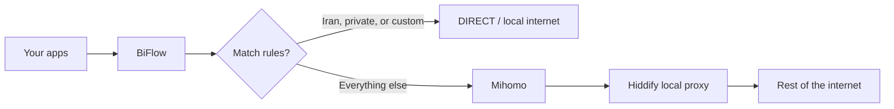

# Alternate VPN clients as the Mihomo upstream

**Status:** implemented-in-part (ADR 0068 client registry; ADR 0067 side-tunnel invariants)  
**Date:** 2026-09-05

BiFlow is already a two-layer stack. Mihomo owns split routing and the system
TUN. Hiddify is only the **upstream SOCKS5 egress**. Another client can take
Hiddify’s place if it exposes a working local SOCKS proxy and does **not** also
take over the default route. A client that only creates a system TUN/VPN is
**not compatible** with the current design, and making it work would be a
different architecture, not a settings change.

This note records that assessment. Nothing in the runtime was changed for it.

---

## What BiFlow actually does today

The product model is explicit: BiFlow does not replace the VPN client. It sits
beside it.



| Layer        | Owner                                    | Job                                                                                        |
| ------------ | ---------------------------------------- | ------------------------------------------------------------------------------------------ |
| Split engine | Mihomo, started by the privileged helper | Creates BiFlow’s TUN (`clash-iran`), hijacks DNS, applies Iran / private / pin rules       |
| VPN egress   | Hiddify, treated as an external process  | Must listen on a **loopback SOCKS5** port. BiFlow never logs into it or writes its profile |

Connect order in `Engine::start_steps`:

1. Confirm the helper is available and authorized.
2. `ensure_hiddify`: TCP-connect to `hiddify.host:hiddify.port`, optionally launch Hiddify, then probe SOCKS with `https://www.gstatic.com/generate_204`.
3. Generate Mihomo YAML and rule files.
4. Helper starts Mihomo, which brings up TUN (`auto-route`, `dns-hijack: any:53`).
5. Wait for controller + rule providers, then confirm TUN is still up.

The generated upstream is hardcoded as SOCKS5 (`crates/iran-split-mihomo/src/lib.rs`):

```rust
proxies: vec![ProxyConfig {
    name: "Hiddify".into(),
    kind: "socks5".into(),
    server: app.hiddify.host.clone(),
    port: app.hiddify.port,
    udp: true,
}],
proxy_groups: vec![ProxyGroup {
    name: "VPN".into(),
    kind: "select".into(),
    proxies: vec!["Hiddify".into()],
}],
```

Defaults: `127.0.0.1:12334` (Hiddify mixed/SOCKS), Mihomo controller `19090`,
mixed-port `17890`, DNS `1053`. The only backend kind is
`BackendKind::ExternalHiddify`. There is no plugin or “generic VPN client”
abstraction.

Hiddify’s own routing is irrelevant. BiFlow only needs a SOCKS path to the
wider internet. Split decisions (private/LAN → VPN pins → DIRECT pins → Iran
lists → `MATCH,VPN`) are entirely Mihomo’s.

---

## 1. Clients that expose a local HTTP or SOCKS proxy

### Technically feasible

This is the same wire protocol BiFlow already uses. If the other client:

- listens on **loopback SOCKS5** (or mixed port that speaks SOCKS),
- has working outbound **before** BiFlow starts TUN,
- does **not** install its own full-tunnel TUN / default route / kill switch,
- can be excluded from Mihomo capture by process name,

then Mihomo can send `MATCH,VPN` traffic there exactly as it does for Hiddify.

The Settings “SOCKS / mixed port” field is already a number. Health checks are
“is this TCP port open?” plus a SOCKS `generate_204` probe. They do not speak a
Hiddify API.

### Not a drop-in today

Pointing the port at v2rayN or HAPP and pressing Connect is **not** enough.

| Constraint                     | Why it matters                                                                                                                                                       |
| ------------------------------ | -------------------------------------------------------------------------------------------------------------------------------------------------------------------- |
| Upstream type is `socks5` only | HTTP-CONNECT-only local proxies fail both YAML and the `socks5h://` egress probe                                                                                     |
| Host is locked to `127.0.0.1`  | Remote or LAN proxies are rejected in the UI schema                                                                                                                  |
| Process bypass is Hiddify-only | Linux: `hiddify`, `*Hiddify*`. Windows: `hiddify.exe`, `Hiddify.exe`, `HiddifyNext.exe`, `*Hiddify*`                                                                 |
| Launch/discover/install/reset  | Paths, GitHub URLs, “Fresh Hiddify start”, and `stop_with_stack` are Hiddify-specific                                                                                |
| UDP                            | Generated proxy sets `udp: true`. A SOCKS port without UDP ASSOCIATE breaks QUIC and some DNS-over-UDP on the VPN path                                               |
| System proxy                   | If the client also sets the OS HTTP proxy, some apps bypass Mihomo TUN; others still hit it. Pause already warns that not every Hiddify mode leaves the OS proxy off |

The process-name gap is the dangerous one. [ADR 0018](../adr/0018-hiddify-egress-before-tun.md)
exists because Hiddify AppImage traffic (`Hiddify-Linux-x`) was captured by
Mihomo TUN, sent back into Hiddify’s SOCKS, and the stack died in ~200 ms. The
same loop happens for **any** unnamed client:

`v2rayN/HAPP outbound → Mihomo TUN → SOCKS back to that same client → collapse`

The pre-TUN probe can succeed, Connect can look healthy, then the tunnel dies
after TUN is up.

### How this would be implemented (conceptually)

A generic “upstream proxy client” layer, not a Hiddify fork:

1. Rename `HiddifyConfig` to an upstream-proxy setting: host, port, type (`socks5` / `http`), optional UDP, start timeout, stop-with-stack.
2. Keep the same Connect gate: TCP listen, then protocol-correct egress probe **before** TUN.
3. Make process-bypass a configurable list (or presets: Hiddify, v2rayN, HAPP, …). On Windows include `.exe` and common child names (`xray.exe`, `sing-box.exe`, `v2ray.exe`).
4. Do not auto-launch unknown binaries unless the user set an executable path. Auto-install stays Hiddify-only unless you add allowlisted downloaders.
5. Require the other client to run in **local-proxy / system-proxy-off / TUN-off** mode. BiFlow owns the only TUN.
6. Keep Mihomo as the only split engine. Do not ask the other client to do Iran/DIRECT rules.

That is moderate product work (config, UI, discovery, bypass list, tests). It
is not a new network architecture.

### Named clients in this class

| Client                   | Fit if used as local proxy | Notes                                                                                                                                                                              |
| ------------------------ | -------------------------- | ---------------------------------------------------------------------------------------------------------------------------------------------------------------------------------- |
| **v2rayN**               | Good                       | Typical SOCKS `10808`, HTTP `10809`. Turn **off** TUN / virtual adapter. Add `v2rayN.exe`, `xray.exe`, `v2ray.exe` to DIRECT. Point BiFlow at the SOCKS port, not HTTP-only.       |
| **HAPP**                 | Good (Hiddify-like)        | sing-box family; mixed/SOCKS is the same pattern as Hiddify. Use proxy mode, not TUN. Bypass `Happ*` / `sing-box`. Default port is not 12334.                                      |
| **Hiddify**              | Designed for this          | Default mixed `12334`, already in bypass rules. Must not also run Hiddify TUN while BiFlow is connected.                                                                           |
| **Psiphon (proxy mode)** | Partial                    | Windows Psiphon 3 often exposes local HTTP/SOCKS. SOCKS must be on and UDP-capable if you care about QUIC. Bypass `psiphon*` / `psiphon-tunnel-core`. Do not use its VPN/TAP mode. |
| **Windscribe**           | Poor as-is                 | Primarily a system VPN. A local proxy, if present, is secondary. Kill switch and its own TUN usually fight Mihomo.                                                                 |

---

## 2. Clients that only create a system TUN/VPN

### Not compatible with the current architecture

Mihomo **always** enables its own TUN (`crates/iran-split-mihomo/src/lib.rs`):

```rust
tun: TunConfig {
    enable: true,
    stack: "mixed".into(),
    device: app.mihomo.tun_name.clone(),
    auto_route: true,
    auto_redirect: false,
    auto_detect_interface: true,
    strict_route: platform == Platform::Windows,
    dns_hijack: vec!["any:53".into(), "tcp://any:53".into()],
},
```

`ensure_hiddify` requires a TCP listener on the configured port. There is no
“use their interface as VPN outbound” path, no way to disable Mihomo TUN, and
no helper command that adopts a foreign adapter.

So Windscribe, Psiphon VPN mode, Hiddify TUN mode, v2rayN TUN, WireGuard,
OpenVPN, and IKEv2 do **not** plug in as Hiddify replacements.

### Why two TUNs fight

Both sides typically want:

- the default IPv4 (and maybe IPv6) route
- DNS hijack or a replaced resolver
- a kill switch / “block traffic not on my interface”

BiFlow’s helper only creates and later deletes **its** interface (`clash-iran`
on Linux via `ip link delete`). It does not negotiate with another VPN.

Observed failure modes:

- Last writer wins the default route; Iran DIRECT leaks into the other VPN, or foreign sites leak DIRECT.
- Double DNS hijack: Mihomo `any:53` vs the other client’s DNS. Fake-IP (`198.18.0.1/16`) then becomes meaningless or blackholes.
- Recursion: Mihomo sends “VPN” traffic into a SOCKS that itself is captured by the other TUN, or the other VPN’s packets enter Mihomo TUN.
- Kill switch: Windscribe-class firewalls drop DIRECT Iran traffic that BiFlow intentionally sends out the physical NIC.
- Helper rollback leaves the other VPN’s routes in place; the machine can stay fully tunneled or fully broken after Disconnect.

### Could Mihomo still “use” a foreign TUN?

In Clash/Mihomo generally, yes, with a **different** design: a `direct` outbound
bound to the VPN interface (`interface-name: <vpn-adapter>`), while true DIRECT
is bound to the physical NIC. Mihomo would still own the capture TUN and rule
engine; the other VPN would be only a next hop.

That only works if you can force the other client into a rare mode:

- its tunnel stays up
- it does **not** install a default route
- it does **not** hijack DNS
- it does **not** enable a kill switch
- its interface name is discoverable and stable
- Mihomo and the helper can bind/route to that interface without enumerating adapters unsafely (Windows currently forbids `GetAdaptersAddresses` in the platform crate)

Most consumer apps will not stay in that mode. Windscribe and similar tools
assume they own the network.

Other approaches are worse for this product:

| Idea                                                                | Problem                                                                 |
| ------------------------------------------------------------------- | ----------------------------------------------------------------------- |
| Disable Mihomo TUN; use only Mihomo mixed-port                      | Loses system-wide split routing unless every app is pointed at 17890    |
| Let the other VPN own the default route; push Iran excludes into it | BiFlow no longer owns rules, DNS, Pause, or rollback                    |
| tun2socks on their TUN to fake a local SOCKS                        | Extra hop, extra process, still need them not to take the default route |
| Policy routing / fwmark only                                        | Linux-possible, Windows-painful, no existing helper commands            |

### Named clients in this class

| Client                               | Assessment                                                                                                           |
| ------------------------------------ | -------------------------------------------------------------------------------------------------------------------- |
| **Windscribe**                       | System VPN. Dual-TUN + kill switch. Not a Mihomo upstream without a supported local SOCKS and split/kill-switch off. |
| **Psiphon VPN/TAP mode**             | Same class as Windscribe. Use proxy mode instead.                                                                    |
| **v2rayN / HAPP / Hiddify TUN mode** | Same conflict as any second TUN. Switch them to local proxy only.                                                    |
| **WireGuard / OpenVPN / IKEv2**      | No SOCKS. Would need interface-bound outbounds and a cooperative tunnel. Not in the current helper/engine.           |

---

## Routing and DNS conflicts (both types)

Precedence today (must stay aligned with `RuleSet::decide` and generated YAML):

1. Process bypass (Hiddify, BiFlow, tailscaled)
2. Loopback / localhost
3. Private / LAN / CGNAT
4. User VPN pins
5. User DIRECT pins
6. Bundled Iran domains and networks
7. `MATCH,VPN` → Hiddify SOCKS

Hard rules that any replacement must keep:

- **Private, loopback, and CGNAT must never go to the VPN list.**
- The upstream client’s **own process** must be DIRECT, or the tunnel recurses.
- Egress must be proven **before** TUN ([ADR 0018](../adr/0018-hiddify-egress-before-tun.md)). After TUN, a SOCKS probe can fail even when the proxy is fine.
- On Mihomo failure, rollback stops Mihomo and owned routes only. It must not kill the user’s VPN client ([ADR 0018](../adr/0018-hiddify-egress-before-tun.md), [ADR 0025](../adr/0025-paused-lifecycle.md)).
- Pause stops BiFlow TUN/DNS/Mihomo and leaves the upstream client running. If that client left a system proxy or its own TUN up, “paused = real local internet” is false.

DNS is a second control plane. Mihomo uses fake-IP, hijacks `any:53`, Iranian
resolvers for DIRECT, and on Windows pins DoH to `#VPN` so Wintun +
`strict-route` does not blackhole bootstrap DNS. A second VPN that also
replaces DNS will break Iran DIRECT, fake-IP, or both.

---

## Windows vs Linux

The two backends implement the same `PlatformBackend` contract, but the network
is not the same.

| Area           | Linux                                                                   | Windows                                                                                                                                          |
| -------------- | ----------------------------------------------------------------------- | ------------------------------------------------------------------------------------------------------------------------------------------------ |
| Capture TUN    | Mihomo `auto-route`, `strict-route: false`, IPv6 on                     | Wintun, `strict-route: true`, IPv6 off                                                                                                           |
| TUN health     | `/sys/class/net/<tun_name>`                                             | Mihomo `GET /configs` `tun.enable` only (no adapter walk)                                                                                        |
| DoH            | Unpinned `https://1.1.1.1/dns-query`                                    | `https://1.1.1.1/dns-query#VPN` — bootstrap must go through the SOCKS upstream                                                                   |
| Process bypass | `/proc` comm; AppImage names differ from the binary (`Hiddify-Linux-x`) | Image names; children like `xray.exe` / `sing-box.exe` need their own rules                                                                      |
| Helper         | Unix socket, systemd/pkexec, can `ip link delete`                       | Named pipe, scheduled task, cleanup is “stop Mihomo”; no interface delete                                                                        |
| Foreign TUN    | `ip rule` / fwmark / `interface-name` are at least expressible          | WFP, NRPT, TAP/Wintun names (`Meta`, empty, device path). Interface binding is harder and adapter enumeration is forbidden in the platform crate |
| System proxy   | Less common; still can leak apps around TUN                             | Very common (v2rayN, Psiphon). Controller client already uses `no_proxy()` so Hiddify’s proxy cannot swallow `127.0.0.1:19090`                   |
| Kill switch    | Usually iptables/nft in the other app                                   | Often WFP; will drop BiFlow DIRECT unless disabled                                                                                               |
| UDP/QUIC       | Mixed stack + sniff QUIC 443                                            | IPv6 off; QUIC still needs SOCKS UDP ASSOCIATE                                                                                                   |

Windows is the stricter platform for a SOCKS upstream (DoH `#VPN`,
`strict-route`) and the worse platform for a TUN-only upstream (no safe adapter
enumeration, Wintun name instability, WFP kill switches).

---

## Bottom line

| Question                                                                                   | Answer                                                                                                                                                                                                                                                         |
| ------------------------------------------------------------------------------------------ | -------------------------------------------------------------------------------------------------------------------------------------------------------------------------------------------------------------------------------------------------------------- |
| Can Mihomo keep doing Iran/DIRECT vs VPN if something other than Hiddify is the VPN layer? | **Yes**, if that something is a **local SOCKS5** egress and BiFlow still owns the only system TUN.                                                                                                                                                             |
| Does the current app support that?                                                         | **No.** The wire format is generic SOCKS; naming, launch, install, probe errors, and process bypass are Hiddify-specific. A manual port change will recurse after TUN unless the other process is DIRECT.                                                      |
| v2rayN, HAPP, Psiphon proxy mode?                                                          | **Feasible** after a generic-upstream design: SOCKS port, TUN off, process-name list, no OS kill switch.                                                                                                                                                       |
| Windscribe, Psiphon VPN, any TUN-only client?                                              | **Not feasible** in the current architecture. Two default routes and two DNS hijacks. A future “bind VPN outbound to their interface” design is theoretically possible and much larger, especially on Windows, and most commercial clients will not cooperate. |
| HTTP-only local proxy?                                                                     | Not today. Generator and probe are SOCKS5/`socks5h` only.                                                                                                                                                                                                      |
| Should BiFlow adopt the other client’s TUN and drop Mihomo TUN?                            | That would abandon the product’s rule engine, Pause/rollback, and helper-owned lifecycle.                                                                                                                                                                      |

The intended shape stays: **one capture TUN (Mihomo) + one userspace VPN egress
(today Hiddify, tomorrow any SOCKS client)**. A second system VPN is a peer, not
an upstream, and the current stack has no way to share the kernel routing table
with a peer.

---

## Related

- [ADR 0018: Probe Hiddify egress before TUN](../adr/0018-hiddify-egress-before-tun.md)
- [ADR 0025: Paused lifecycle and Hiddify ownership](../adr/0025-paused-lifecycle.md)
- [ADR 0033: Windows platform backend](../adr/0033-windows-platform-backend.md)
- [ADR 0034: Bidirectional route pins](../adr/0034-bidirectional-route-pins.md)
- [ADR 0037: Windows Mihomo controller reachability](../adr/0037-windows-mihomo-controller-reachability.md)
- [ADR 0038: Windows TUN readiness](../adr/0038-windows-tun-readiness.md)
