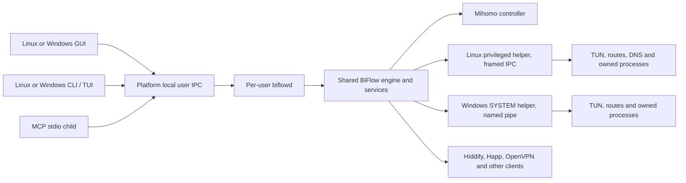

# معماری پیشنهادی، TUI و MCP

## معماری محصول



daemon per-user مالک stack است اگر prototype فاز صفر آن را روی Linux و
Windows ثابت کند؛ وگرنه CLI به همان process GUI وصل می‌شود. helper لینوکس
تنها مرز root و helper ویندوز تنها مرز SYSTEM است. CLI به آن‌ها وصل نمی‌شود.
باینری کاربر root یا Administrator اجرا نمی‌شود و از ورودی کاربر shell
نمی‌سازد.

استخراج سرویس از Tauri باید رفتار فعلی را نگه دارد: یک instance، tray،
`BIFLOW_DEV_PROFILE` با پورت و مسیر جدا از نصب، و عدم اتصال dev به helper
تولید. TUI API جدا ندارد.

### سرویس application مشترک

کدهای orchestration از `src-tauri/src/lib.rs` و startup-specific Tauri باید
به crate application مستقل از Tauri منتقل شوند. آن crate باید عملیات typed
در یک سطح مشترک فراهم کند:

- bootstrap/status و subscription به lifecycle؛
- connect/retry/cancel و graceful disconnect؛
- load/validate/save/apply تنظیمات و بستهٔ export/import مشترک؛
- route pin و rule CRUD/sync؛
- diagnostics، log query، support export و update workflow؛
- repository و backend adapter برای Linux و Windows helper/Mihomo.

Tauri commandها thin adapter بمانند. CLI و MCP همان command dispatcher
کاربردی را صدا بزنند؛ هرگز Tauri command را با اجرای app GUI شبیه‌سازی نکنند.

### بستهٔ تنظیمات قابل‌حمل

روی یک ماشین، GUI و CLI اگر همان runtime و همان `BIFLOW_DEV_PROFILE` را سهم
کنند، همان فایل‌های کاربر را می‌بینند و export لازم نیست. برای جابه‌جایی یا
دادن فایل به طرف دیگر، یک بسته کافی است:

- `manifest` با `schema_version` و نسخهٔ برنامه؛
- `config.toml` همان ذخیرهٔ فعلی، با همان مهاجرت schema؛
- سند پین‌ها همان `RuleManager`؛
- پروفایل‌های محلی (مثلاً `.ovpn`) که config به آن‌ها اشاره دارد، با path
  نسبی داخل بسته.

صادرکننده آخرین persist موفق بعد از apply را می‌نویسد. واردکننده validate
موجود را اجرا می‌کند، بعد همان save/apply. پیش‌نویس GUI یا apply شکست‌خورده
صادر نمی‌شود. GUI دکمهٔ export/import روی Settings با file picker؛ CLI
`settings export PATH` و `settings import PATH`؛ TUI همان فرمان‌ها؛ MCP
`settings_export` / `settings_import` با path. پاسخ MCP تعداد کلاینت و
default route است، نه password و نه YAML کنترلر. path در MCP مسیر دلخواه
سیستم نیست: مطلق، محلی، و زیر home کاربر یا ریشهٔ داده‌ای که همان پروفایل
اجازه داده؛ محتویات فایل به مدل برنمی‌گردد.

### مرز local IPC بر اساس سیستم‌عامل

- **Linux:** Unix domain socket زیر runtime directory همان کاربر با owner
  همان UID و mode `0600`; peer credentials از socket بررسی شود.
- **Windows:** named pipe مخصوص daemon کاربر با ACL محدود به SID همان user
  و session مناسب؛ identity client و DACL قبل از پردازش درخواست اعتبارسنجی
  شوند. این pipe با pipe سرویس SYSTEM helper یکی نیست.
- هر دو: framing و سقف اندازه‌ی پیام، timeout، cancellation، protocol version
  و request UUID.
- API allowlist با enums و schemaهای مشخص؛ هیچ `run arbitrary command` یا
  پاس‌دادن URL/secret آزاد نداشته باشد. خواندن path فقط برای بستهٔ تنظیمات
  زیر home یا ریشهٔ پروفایل.
- daemon عملیات طولانی را به operation record با `operation_id`, phase,
  timestamps و typed result تبدیل کند؛ status و cancel از همان ID باشند.
- بستن TUI یا MCP عملیات را قطع نمی‌کند؛ reconnect وضعیت زنده را می‌خواند.
- قفل تک‌مالک جلوی دو stack را می‌گیرد. مسیر config/log موجود عوض نمی‌شود مگر
  ADR مهاجرت.
- **ویندوز:** pipe کاربر ≠ pipe SYSTEM. بعد از prototype یک عمر process:
  زنده ماندن بعد از GUI، یا خطای صریح که runtime نیست. هر دو با هم ship
  نمی‌شوند. RDP و تعویض session اگر daemon بمیرد باید همان خطا را بدهد نه
  TUN یتیم.
- **لینوکس:** socket زیر runtime همان UID، mode `0600`. helper root سر جایش.
- **WSL هدف نیست.** `doctor` بگوید پشتیبانی نمی‌شود.

محدودیت امنیتی باید روشن باشد: process هم‌UID در Linux یا همان SID در Windows
مرز امنیتی در برابر خود کاربر نیست. scopeها جلوی استفاده‌ی تصادفی ابزار AI و
privilege escalation از helper را می‌گیرند؛ کاربر همچنان مالک config و processهای
خودش است. permissionهای daemon هرگز جای authorization رسمی helper، UAC یا
polkit را نمی‌گیرند.

## طراحی CLI و TUI

### دو حالت مکمل

1. **فرمان‌محور (اول ship می‌شود):** `biflow-cli connect`،
   `status --output json`؛ بدون prompt پنهان.
2. **TUI (بعد از MVP JSON):** `biflow-cli ui` در TTY؛ بدون TTY فقط help.

TUI با crateهای Rust پایدار و قابل حمل (برای نمونه Ratatui/Crossterm پس از
prototype) ساخته شود. dependency با GTK/WebKit/Tauri نباشد. UI از componentهای
قابل‌ترکیب terminal استفاده کند؛ خروجی pipe هرگز ANSI escape نگیرد مگر با
`--color always`. در Windows، Windows Terminal و PowerShell 5.1/7+ و در صورت
امکان conhost مدرن آزمایش شوند؛ نبود ANSI support باید به fallback متنی برسد.
Executable/installer جداگانه‌ی `biflow-cli.exe` با برنامه‌ی رومیزی
`BiFlow.exe` اشتباه گرفته نشود.

### طرح صفحه‌ی اصلی

```text
┌ BiFlow ─ Connected · operation 4f2… ─────────────── Windows 11 ┐
│ INTERNET  ● online     HELPER ● ready     TUN ● active            │
│ DNS       ● listening  MIHOMO ● ready     DEFAULT → Windscribe     │
├ Live traffic ──────────────────────────────────────────────────────┤
│ DIRECT  ▰▰▰▰▱  24.1 MB       Windscribe  ▰▰▱▱▱  8.7 MB             │
├ Clients ───────────────────────────────────────────────────────────┤
│ ● Windscribe  Connected · exit 203.x.x.x  [default]                │
│ ○ Hiddify     Running · local proxy ready                           │
├ Last operation ────────────────────────────────────────────────────┤
│ route.apply   ✓ verified live MATCH → Windscribe   trace 8b1…       │
└ F1 Help  c Connect  p Pause  d Disconnect  r Rules  q Quit          ┘
```

Traffic lights همیشه label متنی داشته باشند (`● ready`, `! degraded`,
`× stopped`)، چون رنگ تنها برای accessibility کافی نیست. رنگ‌های DIRECT و
client مطابق palette مشترک GUI باشند. پنل‌ها در ترمینال کوچک reflow شوند؛
عرض حداقل، UTF-8، tab completion و key hints تست شوند.

### UX قراردادها

- help root شبیه guide کوتاه: purpose، quickstart، group list، examples،
  output formats و کلیدهای TUI. هر زیرفرمان `--help` نمونه‌ی واقعی داشته باشد.
- `biflow-cli doctor` نصب/helper/runtime/network را جدا بررسی و برای هر check
  وضعیت و next step بدهد.
- TUI فقط برای data entry جایی که مفید است prompt بگیرد؛ همه‌ی promptها با
  command معادل قابل اجرا باشند. export/import تنظیمات همان فرمان‌های CLI است،
  نه serializer سوم.
- `--language en|fa` برای help و خطا کافی است. جدول RTL در TUI اگر خراب بود،
  شناسه‌ها LTR می‌مانند؛ برای آن layout جدید طراحی نمی‌شود.
- `--color auto|always|never`; حالت screen reader/monochrome با نماد و label.
- حفظ رفتار `Ctrl-C`, pager اختیاری، resize و terminalهای SSH، tmux و `TERM=dumb`.
- زنده‌نمایی connection totals و status به interval یا event subscription
  bounded متصل باشد؛ polling سریع یا busy loop ممنوع.

## MCP محلی

### Transport و نصب

نسخه‌ی MCP را هنگام شروع اجرا با specification منتشرشده‌ی فعلی تطبیق بده؛ در
تاریخ نگارش این طرح، نسخه‌ی `2026-07-28` منتشر شده است. فاز نخست فقط transport
`stdio` باشد و MCP را با همان CLI executable در هر دو سیستم‌عامل عرضه کند:

```text
biflow-cli mcp serve --stdio
```

کاربر AI host را طوری تنظیم می‌کند که `biflow-cli mcp serve --stdio` را اجرا
کند. نمونهٔ path و quoting برای Windows و Linux در docs کافی است؛ generator
تنظیمات host در نسخهٔ اول لازم نیست. stdout فقط JSON-RPC است؛ پیشرفت و log
به stderr و `debug.log` می‌روند. در MCP، TUI بالا نمی‌آید. HTTP در این طرح
نیست.

### دسته‌بندی capabilityهای MCP

**Tools، ابزارهایی که AI می‌تواند اجرا کند:**

- مشاهده: `biflow_status`, `clients_list`, `connections_list`,
  `rules_list`, `diagnostics_run`, `route_test`, `reachability_check`,
  `client_probe`, `dependencies_list`, `logs_query`, `operation_get`.
- عملیات lifecycle: `connect`, `disconnect`, `pause`, `resume`,
  `operation_cancel`.
- پیکربندی/routing: `client_connect`, `client_disconnect`,
  `client_set_default`, `settings_get`, `settings_validate`,
  `settings_update`, `settings_export`, `settings_import`, `route_pin`,
  `direct_rule_add/remove`, `rule_list_*`, `cloud_rules_sync`.
- recovery: فقط `diagnose_failure` و `apply_recovery_action` با `action_id`
  موجود در محصول (retry تونل، probe egress، fresh Hiddify). عمل جدید برای AI
  اضافه نمی‌شود.
- export/update/install باید طبق policy و permission scope جدا باشند؛ حذف log،
  حذف client، نصب package و update در گروه destructive/high impact بیایند.

**Resources، وضعیت فقط‌خواندنی و redact شده:**

- `biflow://status/current`
- `biflow://clients`
- `biflow://routes/live`
- `biflow://rules/direct`
- `biflow://diagnostics/latest`
- `biflow://operations/{operation_id}`
- `biflow://logs/recent` با تعداد محدود و redaction پیش از return

**Prompts، workflowهای هدایت‌شده و قابل‌انتخاب:**

- `diagnose-connect` و `windscribe-connect` کافی‌اند؛ prompt جدا برای هر دکمهٔ GUI نه.

ترتیب `tools/list` deterministic باشد؛ `inputSchema` و `outputSchema` هر ابزار
در repository version-control و contract-tested باشند. هر ابزار مستند کند که
read-only است یا mutation می‌کند، چه اثر شبکه‌ای دارد، چه scope لازم دارد و
آیا destructive است.

### Policy اجرا و مجوز

داخلی به 3 سطح تقسیم شود:

1. **Observe:** status، logs redact شده، probe و diagnostics.
2. **Network control:** اتصال/قطع، pause/resume، انتخاب default route و pin.
3. **System/config administration:** نصب helper/dependency، تغییرات پایداری
   که restart route می‌خواهند، حذف client/rules/log و update package.

برنامه‌ی AI با روشن بودن MCP همهٔ سطح‌ها را نمی‌گیرد. scope از UI/CLI به همین
سرور داده می‌شود؛ UAC/polkit جداست. «Windscribe را وصل و پیش‌فرض کن» سطح
کنترل شبکه است؛ نصب helper سطح سیستم است. `--yes` جایگزین elevation نیست.

### الگوی AI برای تشخیص و recovery

1. وضعیت و فهرست کلاینت را می‌خواند؛ secret نمی‌گیرد.
2. کار را به فرمان typed و یک `operation_id` تبدیل می‌کند؛ Connect را تکرار
   نمی‌کند.
3. اگر شکست: evidence زنده (`MATCH`، helper، egress) و فقط `action_id` موجود.
4. بعد از mutation دوباره status و probe؛ ادعا بدون verification ممنوع.

مدل shell و ویرایش آزاد profile ندارد.

### Error contract برای AI

هر MCP tool نتیجه‌ی structuredContent و خلاصه‌ی readable بدهد. خطای مناسب
شامل این فیلدها است:

- `code`, `message`, `retryable`, `trace_id`, `operation_id`؛
- `phase` و `component`؛
- `evidence[]` redacted؛
- `suggested_actions[]` فقط `action_id` موجود در محصول؛
- `verification[]` بعد از mutation.

متن خام OpenVPN، profile، URL subscription، secret controller، username,
password، IP شخصی/diagnostic target، env کامل و logهای unfiltered در output
به مدل داده نشوند. diagnostic targetی که خود AI پیشنهاد می‌دهد پس از اجرای
probe هم secret نیست، ولی output باید فقط مقدار لازم را نگه دارد و log policy
موجود را رعایت کند.

### Compatibility MCP

اگر SDK Rust برای spec پین شده در release پایدار نبود، adapter نازک TypeScript
کنار همان باینری CLI در ADR جدا تصمیم گرفته می‌شود. پروتکل از صفر پیاده
نمی‌شود. HTTP MCP در این طرح نیست.

## به‌روزرسانی پروتکل

Feature parity خود MCP را با نسخه‌ی spec پین و contract tests بپوشان. در زمان
پیاده‌سازی، MCP release را دوباره از [مخزن رسمی](https://modelcontextprotocol.io/specification/)
بررسی کن؛ protocol draft را به production pin نکن. stdio framing، cancellation،
schema compatibility و stdout purity در CI تأیید شوند.
